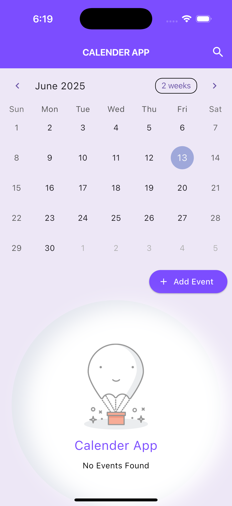
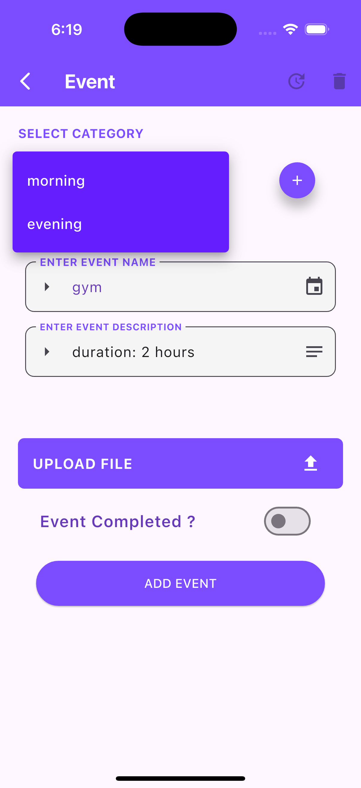
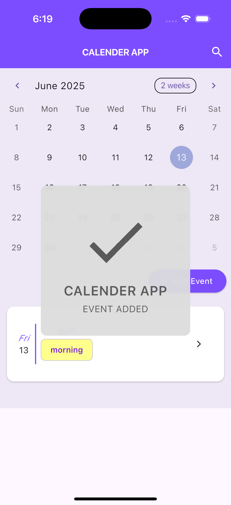

# 📅 Calendar App

A Flutter-based calendar application that allows users to seamlessly **add**, **view**, and **manage events** locally using **Hive**. Built using clean architecture and **Provider** for state management, the app offers a smooth, responsive UI with **Dark Mode** support and offline capability across Android and iOS.

---

## 📘 About Calendar App

The Calendar App is built to showcase practical usage of **local databases in Flutter** using **Hive**, with a focus on efficient state management, intuitive event handling, and elegant UI design. It's a part of a structured Flutter learning module, crafted to demonstrate a full-featured calendar system.

---

## ✨ Features

- 📆 View events on specific calendar dates.
- ➕ Add, edit, and delete events easily.
- 💾 Offline support using **Hive** for persistent local storage.
- 🌙 Dark Mode enabled for a better UI experience.
- 🔄 Reactive UI updates using **Provider**.
- 📁 Clean architecture and organized project structure.

---

## 🛠️ Tech Stack

| Technology            | Description                                               |
|-----------------------|-----------------------------------------------------------|
| **Flutter**           | Cross-platform framework for Android/iOS development      |
| **Dart**              | Programming language used to write Flutter apps           |
| **Hive**              | Lightweight NoSQL database for local storage              |
| **Provider**          | State management for reactive UI                          |
| **TableCalendar**     | Flutter widget for calendar-based UI                      |

---

## 🧑‍💻 Contributions / What I worked on

- 🖌️ Designed and implemented the calendar-based UI using `table_calendar`.
- 🔄 Integrated **Provider** for managing events across the app.
- 🗃️ Used **Hive** for local data persistence of calendar events.
- 🌙 Implemented dynamic theme switching (Dark Mode).
- 🧱 Followed clean architecture and modular code structure.
- 📱 Tested the app across Android and iOS platforms.

---

## 📸 Screenshots

<p align="center">
   &nbsp;
   &nbsp;
   <br><br>
 
</p>

---

## 🚀 Getting Started

1. **Clone the repository:**

    ```bash
    git clone https://github.com/your-username/calendar_app.git
    cd calendar_app
    ```

2. **Install dependencies:**

    ```bash
    flutter pub get
    ```

3. **Run the app:**

    ```bash
    flutter run
    ```

---

## ✅ Prerequisites

- Flutter SDK installed  
- Android Studio / Xcode / VS Code  
- Android Emulator or iOS Simulator (or real device)

---

## 📦 Dependencies Used

| Package                                | Purpose                                      |
|----------------------------------------|----------------------------------------------|
| [`hive`](https://pub.dev/packages/hive)                    | Local NoSQL database                         |
| [`hive_flutter`](https://pub.dev/packages/hive_flutter)    | Hive integration for Flutter                 |
| [`provider`](https://pub.dev/packages/provider)            | State management                             |
| [`table_calendar`](https://pub.dev/packages/table_calendar)| Calendar UI widget                           |
| [`path_provider`](https://pub.dev/packages/path_provider)  | To get platform-specific directories          |

---

## 📧 Contact

For any queries, feel free to reach out at:  
📩 **nikhilsethi2k3@gmail.com**  
🔗 GitHub: [github.com/whonikhilsethi](https://github.com/whonikhilsethi)

---

## 📚 References and Resources

- [Flutter Documentation](https://docs.flutter.dev/)
- [Hive Docs](https://docs.hivedb.dev/)
- [Provider Package](https://pub.dev/packages/provider)
- [Table Calendar Docs](https://pub.dev/packages/table_calendar)

---

⭐ *If you found this project helpful, consider starring it on GitHub!*
